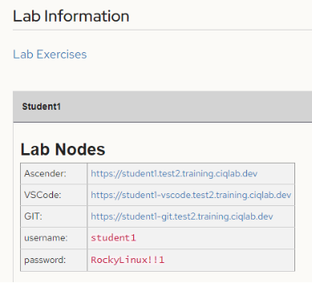
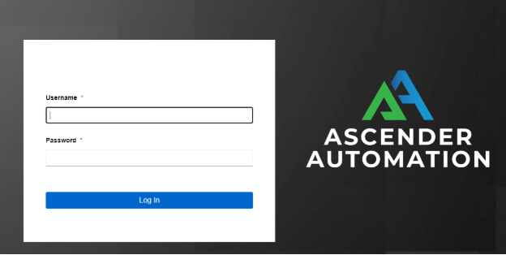
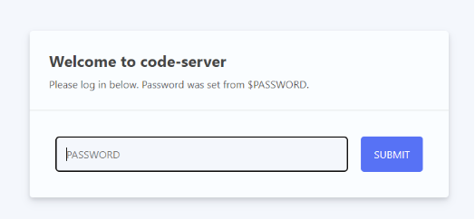
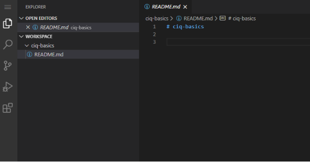
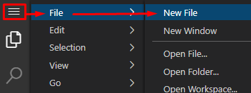
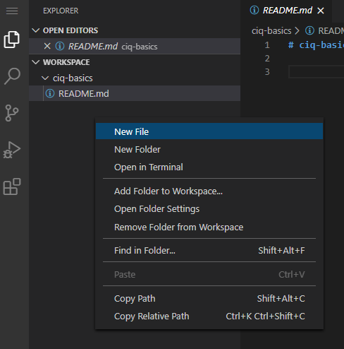
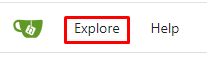
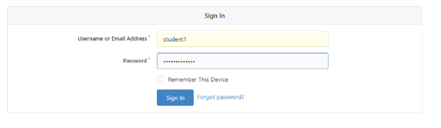
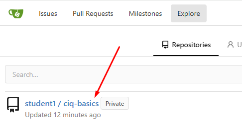
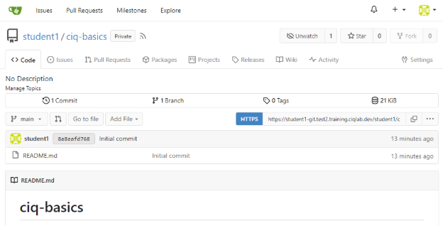

Basics 1.1 - Connect To Lab

# Connect To Lab
Now that you have been assigned a lab, let’s explore the various components.

Your individual lab will have unique links just for you.  The ones shown here are just for reference.  **Be sure to open these in a new tab(keep this original page open to maintain access to the links and credentials).**

## Ascender
This will open a page that requires the username and password supplied.  We’ll be covering this extensively later in the course, so I’ll move on.

## VSCode
All of our playbook creation will be done from here.  This is simply a web version of the same VSCode you can load locally on your personal computer after this course is over.

When connecting to VSCode it will prompt for a password.  Use the supplied password from the Lab page:

Once connected, your VSCode should look similar to the below image:

On the left we have two important menus; the first is the Explorer menu is loaded by default(as shown above).

The second is the Source control menu shown as the highlighted below:

The source control is used to interact with our git repository(updating files).  We’ll cover this more in depth in the next chapter.

You have two options for creating files and folders in the VSCode Explorer:

You can use the file menu to create files and folders:

My preferred method is to just right click and create the resources:

VSCode is intuitive much like a windows desktop interface.

## GIT
We’ve also installed a Gitea server for you to use as your git repository.  You don’t actually need to connect to this server at all since it will all work will be done through your VSCode server, but it’s here if you wanted to browse around it.

**Optional**

If you want to browse the server, open the gittea link, click the Explore option in the top left, use the username/password from the lab screen:

From here I should see my repository.  I can click on it to see my playbooks…I currently don’t have anything in there, but this is where they will begin to show up:

