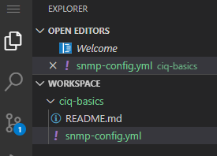

# Basics 1.2 - Build a simple playbook

## Starting Our Playbook

Let's start by creating our first **playbook**.  When writing **YAML** files one of the key things to remember is to **use spaces not tabs**.  Some IDEs will translate a click of the tab key to be two spaces instead, but just be aware that it's not always the case.  Ansible is extremely sensitive to this and the majority of your mistakes, whether beginner or veteran, will be because of spacing issues.  

> A *good practice* is to indent by two spaces when required.

In **VSCode**, **create** a new file named **snmp-config.yml**.  

To do this: In **Explorer**, right click the **ciq-basics** folder and select **New File**:

When the new file appears, name it as **snmp-config.yml**, and hit **enter**:

replace

This will open the file editor.  Notice that it will keep all of your open files as tabs at the top that you can move between:

replace

Start the newly created file with the following:

    ---
    - name: SNMP updates
      hosts: rtr1
      gather_facts: false

**Playbooks** always begin with three dashes.

Next is a "**- name**" entry.  Here, and in most cases, the *name* entry is optional, but should be specified.  Whenever the playbook runs it will print out the name entries which help with understanding what is happening in this specific portion of the playbook.  If there are any errors, it will specify which host and at what task.

Next comes the **hosts** portion, and it deserves its own section.  I'll talk about its relationship to inventories.

## Hosts Vs Inventory - \*\*\*Informational Only\*\*\*
### Inventory
I'll start by discussing **inventories**, which are really just big lists of all the hosts I could possibly operate against.  Inventories also, generally, store additional variables for individual hosts or for groups of hosts.

When using Ansible on the command line you will maintain these inventories in simple flat files either in **INI** or **YAML** format (it seems INI is the most common type seen).

#### INI Format

    [web]
    web1.gregsowell.com
    web2.gregsowell.com
  
    [db]
    db1.gregsowell.com
    db2.gregsowell.com

#### YAML Format

    web:
      hosts:
        web1.gregsowell.com
        web2.gregsowell.com
  
    db:
      hosts:
        db1.gregsowell.com
        db2.gregsowell.com

**Inventories** in Ascender are stored directly in the database like so:

Ascender inventories can also be sourced from **dynamic inventory scripts**, which means Ascender will reach out to some external source like a network monitoring system or ServiceNow's Configuration Management Database (CMDB), and pull in hosts dynamically so that the inventory will always be up-to-date.

### Hosts
Playbooks have a section called "**hosts**".  This required option is where you will specify which specific hosts inside of the inventory you want to operate against.

Take for example this playbook for updating packages in Rocky.  
[https://github.com/gregsowell/ascender-rocky-lts/blob/main/rocky-update-mixed-lts.yml](https://github.com/gregsowell/ascender-rocky-lts/blob/main/rocky-update-mixed-lts.yml)

I'll grab a little snippet from the beginning:

    ---
    - name: Perform package update with LTS support
      hosts: lts_demo

The **hosts** section consists of a comma separated list of hosts, a comma separated list of groups, or a comma separated combination of both hosts and groups.  

A good practice is to simply reference a group or groups when writing playbooks.  If you target specific hosts, which is fine from time to time, when you want to change which host to operate against, you have to update your playbook before rerunning your automation.  My goal is always to change as few things as possible, and to touch my playbooks only when necessary.  If I reference a **group**, then as hosts get added and removed from the group, I never have to modify my playbook!

## Back To The Playbook

    ---
    - name: SNMP updates
      hosts: rtr1
      gather_facts: false

The hosts selected here will be **rtr1**.  It is a Cisco Nexus Virtual switch provisioned specifically to test with.

Next I have **gather_facts: false** set.  By default Ansible will attempt to connect to the hosts and gather information about them that is returned in a variablized manner.  This info is great for reporting or used when making conditional decisions, but will increase processing time when not needed.  Which is why I most often have it turned off.  In the case of networking, if you have gather_facts enabled (which is the default), it will almost always error out.  **Gather_facts** was really designed to pull from servers, not network elements.  **Networking devices have their own dedicated fact gathering modules** (demonstrated later in the course).

## Tasks Portion
Let's finish the playbook.  All of the action really happens in the **tasks** portion of the playbook.

Try adding this to your playbook, and there is no shame in copy/paste, but **typing it will get you in the rhythm of spacing things correctly**.

      tasks:
      - name: Configure SNMP with the config module
        cisco.ios.ios_config:
          lines:
            - snmp-server community public RO
            - snmp-server community private RW

Notice I start the tasks section with "**tasks:**".  The task above performs a single piece of automation.  In this case, it is configuring SNMP communities via the **ios_config** module.  Notice that it is using the *Fully Qualified Collection Name (FQCN)*.  The format is **namespace.collection.module**.  We are showing our first key/value pair of lines and its data.  The config module allows you to supply lines of commands exactly as you would use them from the CLI, which allows you to more easily apply discrete changes to your hosts.

Now to verify our changes.

Add the following to your playbook:

      - name: Find current SNMP configuration
        cisco.ios.ios_command:
          commands: show run | inc community
        register: snmp_output

This task will use the **ios_command** module to issue a `show run` command and save the returned information as **snmp_output**.

Add this final task to the playbook:

      - name: Display current SNMP configuration
        ansible.builtin.debug:
          var: snmp_output.stdout_lines

This last task uses the **debug** module.  Debug simply displays things to screen, and I use it constantly.  If the purpose of the playbook is to display info or if you are debugging or building, it is equally useful.  Here I use the **var** option to simply dump the contents of a variable out.

Your completed playbook should look like this:

    ---
    - name: SNMP updates
      hosts: sw1
      gather_facts: false
      tasks:
  
      - name: Configure SNMP with the config module
        cisco.ios.ios_config:
          lines:
            - snmp-server community public RO
            - snmp-server community private RW
  
      - name: Find current SNMP configuration
        cisco.ios.ios_command:
          commands: show run | inc community
        register: snmp_output
  
      - name: Display current SNMP configuration
        ansible.builtin.debug:
          var: snmp_output.stdout_lines

### Task Parameter Vs Module Parameter
Spacing in playbooks have a very specific purpose, which is to show where various parameters are being applied.  Take the task below for example:

      - name: Set SELinux is set to enforcing
        ansible.builtin.lineinfile:
          path: /etc/selinux/config
          regexp: '^SELINUX='
          line: SELINUX=enforcing
        register: selinux_set

In this example we are using the **lineinfile** module, which has a few parameters that are specific to it.  These parameters (**path, regexp, and line**) are indented below the module itself.  Being indented (two spaces in) directly after the *module* designates these parameters to be *module* parameters (options unique to this module).

Also notice in this example that the "**register**" option is in the same column as the **module**.  This is because it is a **task** parameter, which means that it applies to the *task* and not the *module* specifically.  

Most **task** parameters can be utilized on any task, no matter what module you are using.  **Module** parameters are options that are specific to this module.

## Add Playbook To SCM

Your playbook must be saved in a **Source Control Management (SCM)** system of some kind.  The de-facto standard and one that's also well supported by Ascender is **Git**.  Again, we are using Gitea, but really, anything that supports git is acceptable.  Using VSCode we can now push this playbook to our git repository.

On the left menu, you should see the **Source Control** button with a small "**1**" next to it.  This indicates we have changes we can push.  **Click** that *button* to start the **push** process:

From here you want to add a **commit message** (what message will be logged to the git server with this push), and click the **commit button** (looks like a check mark):

A message will pop up about **staged** changes.  To save ourselves time in the future, click **Always**:

Now, we instruct VSCode to push the changes by clicking **more actions** and **Push** or the "**Sync**" button at the bottom:

Or

> **Any time we make a change to a playbook we will need to follow this procedure.**

Keep in mind that if you are using a cloud based git repository, **do NOT store sensitive information in public facing repositories**.  Using Ascender, you shouldn't have to store any sensitive information, but during testing it's often easier to just hard code information.  When in doubt, keep your repo private.

> **Also of note is that you need to switch back to the Explorer menu if you want to create new files or folders!**

  

[Back to Index](/docs/)