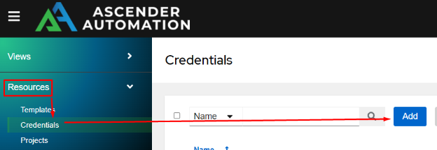
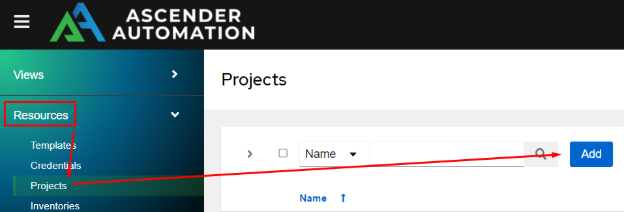
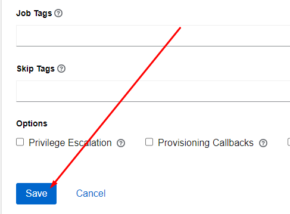

# 1.3 Job Template Creation In Ascender

In the previous section we've built our first playbook, now let's get it into Ascender so we can launch it.  Ascender has several components that must be assembled before a piece of automation can be run.  

## Add Credentials
When connecting to hosts, we must **authenticate** to them with some form of credentials.  Ascender will store secret information encrypted in its database for injection to playbooks at run time.  This means I don't have to store any sensitive information directly in my playbook.

Adding a **Credential** to Ascender is done in the **Credentials** section under the **Resources** menu.  From here, click **Add**.

From here you will want to create a **Machine** credential.  I'm keeping things simple and just using a username / password.

|Name|basics-credential|
| :- | :- |
|Description|CIQ basics credential|
|Credential Type|Machine|
|Username|admin|
|Password|admin|

The most commonly used credential type is **Machine**.  It's used for Linux, Windows, Network, security, and other hosts.  There are a myriad of other credential types for different applications, and there is even the ability to create a **custom credential** to store whatever confidential information that's required.

Speaking of other types of credentials, let's also create one to connect to our git repository with.  

**Create** a new credential with the following information:

|Name|scm-basics-course|
| :- | :- |
|Description|SCM credential for basics-course|
|Credential Type|Source Control|
|Username|Username from Lab tab|
|Password|Password from Lab tab|

## Adding A Project

**Projects** are how we connect a git repository to Ascender to bring in playbooks, templates, roles, etc.

Before we add the project, we need to figure out what the "**Source Control URL**" will be.  You can log into the Gitea server, but it's likely easier for you to just directly build the URL, then paste it in.  

Start by looking at your **username** again from the main lab screen:

In my example, the username is "student1", but yours will be different.

Use YOUR student name to replace **`[YOURID]`** in the following:

`https://[YOURID]-git.network.workshop.ciqlab.dev/[YOURID]/ciq-basics.git`

So, in my example, where my student is "student1", the result would be:  
<https://student1-git.network.workshop.ciqlab.dev/student1/ciq-basics.git>

> **\*Remember, don't copy/paste my example directly, rather build your own with your student ID when filling out the project info below\***

From the **Resources** menu, choose **Projects** and click **Add**.

From the **Create New Project** screen fill in the blanks as follows:

|Name|basics-course|
| :- | :- |
|Description|CIQ basics repository|
|Source Control Type|Git|
|Source Control URL|
This is the URL we built from above.  Be sure to fill it in to meet your personal student id, don't simply copy/paste!

For student1, this would look like https://student1-git.network.workshop.ciqlab.dev/student1/ciq-basics.git
|
|Source Control Credential|scm-basics-course|
|Update Revision on Launch|Checked|

A quick note on **Update Revision on Launch**: this option will synchronize this repository every time a piece of automation is run from it.  This is great while we are developing as it will automatically pull in my new playbook changes.  If, however, I'm not developing and simply running playbooks, this will add unwanted processing time to my automations.  I generally leave this option off, but since we will be actively working on playbooks (and when you are first starting you will inevitably have errors), let's turn it on.

After clicking **Save** the repository will start syncing.

Once complete it will show **Successful**.

## Review Your Inventory

As previously discussed, an **inventory** is a big list of hosts I could possibly operate against.  One of the more useful features of Ascender is its ability to dynamically build an inventory.  This could be from a *Configuration Management Database (CMDB)* like that built into ServiceNow or perhaps via a cloud provider.  For this workshop, we have already created / populated your inventory.  **This means no modifications are required, but let's look at the steps required to create one anyway.**

To view our inventory, in the **Resource** menu click on **Inventories**:

You can see **basics-inventory** in the list, which is what we will use for this workshop.  If it didn't exist, we would click **Add**, and choose **Add Inventory**.  Again, we don't have to as it already exists.

To enter the inventory I'll simply **click** on it's name:

From here I will click on the **Hosts** tab to review all of the hosts currently in this inventory:

The **hosts** section will allow me to click on any *host* to view any additional information about said host.  I'll click on my **rtr1** to see what info is there:

If your *hostname* (the name section above) is a *Fully Qualified Domain Name (FQDN)*, then you are done.  If it's not, there's a magic variable known as **ansible\_host** you can fill out to supply the IP address used to connect to the host with.  You can also add any additional variables here if desired.

You'll notice there are a few extra *variables* specified for this host:

**ansible\_connection** sets the connection plugin for this host.  For network elements you might see *httpapi*, *netconf*, or most likely *network\_cli*.  *network\_cli* instructs Ansible connect to it as if it were a standard CLI device(which ours is).

**ansible\_network** is used to tell Ansible what make/model this device is for proper communication.  This could be *ios*, *nxox*, *routeros*, *eos*, etc.  It's essentially saying "*this is the language this thing speaks*"

**ansible\_ssh\_common\_args** are just some special settings for the SSH connection.  The model of router we are automating against requires some specific connection algorithms.

## Add A Job Template
**Job Templates** are where everything comes together.  This is, ultimately, what allows you to run playbooks.

To add a *template*, go to the **Resources** menu on the left, choose **Templates**, Click **Add**, and choose **Add Job Template**.

Use the following to complete the template.

|Name|basics-snmp-config|
| :- | :- |
|Description|CIQ basics configure snmp|
|Inventory|basics-inventory|
|Project|basics-course|
|Playbook|snmp-config.yml|
|Credentials|basics-credential|
|Execution Environment|network-ee|

> **TIP:** When filling out options like inventory, project, and credentials click the magnifying glass and choose the correct option from the list.

Don't forget to click **Save** at the bottom of the page:

  

[Back to Index](/docs/)