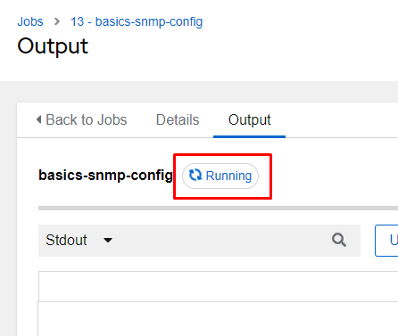

Basics 1.4 - Execute a playbook

## GUI Launch

From the Resources menu on the left, choose Templates.

This brings up the Templates menu, and from here to the right of each item, you can click the rocket ship to launch a job.  **Launch the basics-snmp-config job template**.

Once a template is launched you are brought directly to the running job in the Views - Jobs menu.

As the job completes output should start appearing, and once complete should show the play recap at the end.

Any object in red, green, or orange should be clickable to gain more information:

On the job output screen, you can click the Details tab to gain additional insights on the job run.

Not only did our playbook run correctly, but it also displayed the results to screen of what the config looks like now.  This means it’s not necessary to actually connect to the end device for verification, this can actually be built into our playbooks!  Through this course verification will be baked into the playbooks.

**Optional Only**

If, however, you did want to connect to the device and verify its configuration, you can do this by clicking on View then New Terminal.  The terminal will allow you to ssh into the host with the lab credentials supplied from the workshop main page.  Issue the ssh command as follows “ssh rtr1” and enter username/password when prompted:

[screenshots of sshing in]

Replace

Now issue the show command “show run | inc community”.

[screenshots of the command]

Replace
## Idempotent
The concept of idempotency is one that says “I can run the same piece of automation multiple times and if a change is required, Ansible will make a change, and if not, it will do nothing.”

To test this, let’s rerun our same job template by clicking on the rocketship again from the output tab on our last job run.  This will relaunch the job again.

Notice on the returned results instead of saying “changed” for the first task it just says “ok”.  That’s because the CLI commands already exist in the desired state, so no change was needed.  This means that an idempotent playbook can be run multiple times without negative impact to the end hosts.

This doesn’t mean *all* playbooks are idempotent, rather most modules do support it, but it’s not guaranteed.

Returned output is usually one of 4 things:

|ok|Everything executed fine, but no changes were made.|
| :- | :- |
|changed|Everything ran fine, but it appears that a change was made.|
|failed|The task failed for a host.  This will cause the playbook to show a failed status.|
|skipping|This task had a conditional set, and the host didn’t match, so it skipped for this specific host.|

In fact, most things configured with a network “config” module aren’t fully idempotent.  For example, on our SNMP settings, if we wanted to define exactly how they should be configured we either have to use a resource module or take multiple config steps to ensure it’s the way we want.  Let me demonstrate what I mean.

Our current snmp playbook defines two community configurations:

            - snmp-server community public group network-operator
            - snmp-server community private group network-admin

What if tomorrow I want there to only be the private community entry on the device like so:

            - snmp-server community private group network-admin

I’ll modify my playbook like so and run it again:

      - name: Configure SNMP with the config module
        cisco.ios.ios_config:
          lines:
  #         - snmp-server community public RO
            - snmp-server community private RW

As you can see I commented out the public community, so that command won’t be used, but my output looks like the following:

This is because the config module just issues CLI commands like any user would, so if an admin would normally need to issue a “no” version of a command, then we would still need to do that here.  That is unless we were using a resource module…which we’ll cover in the next section.
