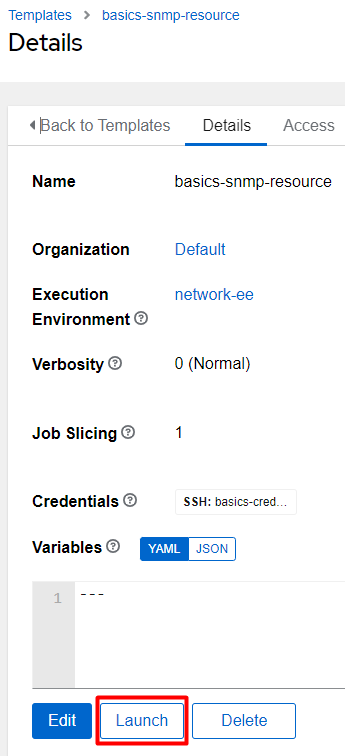

# Basics 1.5 - Resource Modules

As mentioned in the last lab, **config** modules aren't inherently idempotent, which means you either start adding additional tasks to add the idempotency or you start using **resource** modules.

## Create Resource Module Playbook
I'm going to start by duplicating our previous playbook, then making some simple modifications to it.  In VSCode I'm going to right click the **snmp-config.yml** file and choose **Copy**.  I'll then right click in the empty area and choose **Paste**:

I'll now rename the **snmp-config copy.yml** file to **snmp-resource.yml** by hitting **F2** and renaming it:

**Replace** the first task with the following:

        - name: Replace existing SNMP configuration with the ios_snmp_server module
          cisco.ios.ios_snmp_server:
            config:
              communities:
                - name: public
                  ro: true
                - name: private
                  rw: true
            state: replaced 

Comparing this new task to the old you first should notice that we are now using the resource module "**ios\_snmp\_server**".  This resource module has all of the parameters you could want as far as configuring your snmp server settings.  Here we're just setting up the **communities** along with their groups (exactly what we were configuring in the previous playbook).

You can see we have put the relevant info in the **communities** section specifying the **name** and **group** for our switch.

Last, notice the **state** I'm specifying.  This, like many resource modules, has many options for **state:** *merged (default), replaced, overridden, deleted, parsed ,gathered, rendered*.  Here we're using **replaced** which means all settings will be removed and replaced with what is shown here.  This means it will delete anything not specified, so essentially I'm defining exactly what the state of the switch should be.

The updated playbook should look like this:

    ---
    - name: SNMP updates
      hosts: rtr1
      gather_facts: false
      tasks:
    
        - name: Replace existing SNMP configuration with the ios_snmp_server module
          cisco.ios.ios_snmp_server:
            config:
              communities:
                - name: public
                  ro: true
                - name: private
                  rw: true
            state: replaced 
    
        - name: Find current SNMP configuration
          cisco.ios.ios_command:
            commands: show run | inc community
          register: snmp_output
    
        - name: Display current SNMP configuration
          ansible.builtin.debug:
            var: snmp_output.stdout_lines

#### \*Informational Point\*

There's an interesting concept hidden here in this playbook I've not discussed yet, and that's the **register** option in this task:

        - name: Find current SNMP configuration
          cisco.ios.ios_command:
            commands: show run | inc community
          register: snmp_output

**Register** is a *task* level parameter that will save all of the output from a task into a **variable** you specify.  This this case I'm saving all the result of the `show run | inc community` command into a variable named "**snmp\_output**".  This can be useful for reporting as we are doing here (debugging the info to screen), gathering information for reporting purposes (making a CSV for example), or gathering information to do further processing or conditionals later in the playbook.  **Variables** will be covered more in-depth in a later chapter.

## Copy A Job Template
Now that I've saved the new file in my git repository I'll resync the project in Ascender so that it will show up as a usable playbook.  From the **Resources** menu, click on **Projects**, then the **Sync Symbol** next to my **basics-course** project.

> Anytime you create a new file / playbook and then want to create a Job template to execute that file; you will need to Resync the project file, as nothing has forced the project to pull in this new playbook yet.

I'll now cheat by duplicating my previous job template, and changing a few options.

From the **Resource** menu, click **Templates**, then click the **Copy** button:

Let's **Edit** the new job template and modify some of the values.

Now click **Save** at the bottom and then **Launch** the new job template you just created:

As you can see from the job output, it is performing the exact same task, and thus nothing has changed.

Modify your *playbook* by commenting out the **public community** like so (**#** are comment characters in Ansible):

        - name: Replace existing SNMP configuration with the ios_snmp_server module
          cisco.ios.ios_snmp_server:
            config:
              communities:
                # - name: public
                #   ro: true
                - name: private
                  rw: true
            state: replaced 

Now **Save/Commit/Push** your playbook, and **Launch** the job template again:

Looking at the output, it shows up exactly as I stated in my playbook!  So not only will the "**state: replaced**" add entries, but it will also *remove* any that aren't necessary!  While this logic is fantastic for easily being able to define the exact state for various components, it can also be dangerous… imagine if you were to accidentally leave off something important and it were deleted.

You should already have good change control procedures in place, thus any of those snafus should be caught ahead of time.  I especially like this logic for ACLs as it greatly simplifies the process of maintaining them via automation.  If you are somewhat risk averse you can always use "**state: merged**" to add entries to what's already there, and "**deleted**" to remove anything you don't want.

## Bonus Content - \*If You Finish Early\*
I'm guessing you noticed one of the **state** options was called "**parsed**".  What this does is *ingest* commands in CLI or "`show run`" format and parses them into the key/value pairs the module expects.  How I use this is to store my full configurations (or just changes I want to make) in standard CLI format instead of filling out key/value pairs.  I then use the parsed option to do the dirty work for me.

Let's start by creating a file with my CLI commands.  In **VSCode Explorer** menu, right click and create a new folder named "**files**".  Remember Ansible is case sensitive, so keep it all lower case.  

Now right click the **files** folder and create a new file named **snmp.txt** with the following contents (just regular CLI commands):

`snmp-server community public RO`  
`snmp-server community private RW`

Now for the playbook.  Modify your **snmp-resource.yml** playbook to look like the following:

    ---
    - name: SNMP updates
      hosts: sw1
      gather_facts: false
      tasks:
    
        - name: Parse config
          cisco.ios.ios_snmp_server:
            running_config: "{{ lookup('file', 'files/snmp.txt') }}"
            state: parsed
          register: parsed
    
        - name: Display parsed SNMP configuration
          ansible.builtin.debug:
            var: parsed
    
        - name: Replace existing SNMP configuration with the ios_snmp_server module
          cisco.ios.ios_snmp_server:
            config: "{{ parsed.parsed }}"
            state: replaced 
    
        - name: Find current SNMP configuration
          cisco.ios.ios_command:
            commands: show run | inc community
          register: snmp_output
    
        - name: Display current SNMP configuration
          ansible.builtin.debug:
            var: snmp_output.stdout_lines

The first *task* uses the same **ios\_snmp\_server** module we are accustomed to, but it sets the **state** as "**parsed**".  

Also notice that the **running\_config** parameter is set to **"{{ lookup('file', 'files/snmp.txt') }}"** .  This is using a **lookup plugin** to grab the contents of our **snmp.txt** file.

Once the config is parsed it's saved into a *variable* named "**parsed**".

I then **debug** the **parsed** variable to give you an idea of the contents… as you can see the **debug** command can be extremely useful for figuring out which parts of a registered variable we need to use.

Finally, I've modified the following task to use the parsed information:

        - name: Replace existing SNMP configuration with the ios_snmp_server module
          cisco.ios.ios_snmp_server:
            config: "{{ parsed.parsed }}"
            state: replaced 

As you can see I no longer have the *parameters* under **config**, rather I'm using the "**parsed.parsed**" variable here.  This opens up so many possibilities.  For one, I can reuse this playbook without having to make modifications to it, I only have to update the **snmp.txt** file.  So I can rerun this and change the source file for future updates.  I can also feed the parsed command a full standard "`show run`" output and it will parse just the SNMP portions for me, so I can store my device's desired full config as code!

You should now be able to **Launch** your job template again to see it perform the magic.

  

[Back to Index](/docs/)