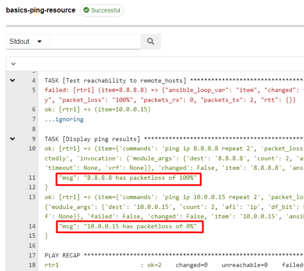

# Basics 1.6 - Variables And Loops

When creating our playbooks thus far, we've used **variables** just a bit, so let's dive in and learn a little more about them.

## Variable Basics
### Naming Rules
There are a few rules to *variables*:

- Can only contain numbers, letters, and underscores
- Can not be numbers only
- Can not begin with numbers
- Case sensitive

> Generally variables are all lower case and separated by underscores; EX: my\_variable\_name.

## Creating A Playbook

Let's create a new playbook by right clicking the **basics** folder in VSCode's explorer view and choosing **New File**.  Name the new playbook **ping-resource.yml**. This playbook will, you likely guessed it, ping some hosts using a *resource* modules.  Start your playbook with the following:

    ---
    - name: Ping remote hosts
      hosts: rtr1
      gather_facts: false
      vars: 
        remote_hosts:
          - 8.8.8.8
          - 10.0.0.15

Here you can see something new, a "**vars**" section.  A "*vars*" section can be added to a whole play or to an individual task.  These sections are used for scoping variables, as in a *vars* section at the *play level* is available to all tasks, and a *vars* section on a task is only available to that task.  Here you can see it's at the top level of the playbook, so it applies to all following tasks.  Notice I create a list variable named "**remote\_hosts**", and inside of it will be all of the remote destinations that I want to ping from the host.  You can see here I have two entries, but this could be 1 or 100, it's totally up to you.  

### Loops
Now let's start the **tasks** section by adding the following to your playbook:

      tasks:
  
        - name: Test reachability to remote_hosts
          cisco.ios.ios_ping:
            dest: "{{ item }}"
            count: 2
          loop: "{{ remote_hosts }}"
          ignore_errors: true
          register: ping_results

This uses the **ios\_ping** module to issue standard ICMP pings from the host to remote destinations.  You'll notice here that we are using variables as you can recognize the quotes and double braces, but you can also see that there is a new task level parameter called "**loop**" that's been introduced.

The **loop** parameter, when added to a task, allows you to iterate over a list of items.  This list can be a statically defined list of things, or can be information dynamically collected via a task and used in subsequent tasks.  This is where the flexibility portion comes into play; if a task returns a list of 2 items or 10 items, they will all be efficiently iterated against.

You can see in the **loop** here, we've presented it with the variable **remote\_hosts**.  So as this task iterates over the loop, the returning information is presented to the task via the variable "**item**".  You can see in the dest key that I'm specifying the variable as "**{{ item }}**".  This means the task will loop two times for each host supplying the module with the results of the loop (since the list variable has two entries).  Now let's add an additional task to verify our results (notice it's using a loop too):

        - name: Display ping results
          ansible.builtin.debug:
            msg: "{{ item.invocation.module_args.dest }} has packetloss of {{ item.packet_loss }}"
          loop: "{{ ping_results.results }}"

The full playbook should look like this:

    ---
    - name: Ping remote hosts
      hosts: rtr1
      gather_facts: false
      vars: 
        remote_hosts:
          - 8.8.8.8
          - 10.0.0.15
      tasks:
    
        - name: Test reachability to remote_hosts
          cisco.ios.ios_ping:
            dest: "{{ item }}"
            count: 2
          loop: "{{ remote_hosts }}"
          ignore_errors: true
          register: ping_results
    
        - name: Display ping results
          ansible.builtin.debug:
            msg: "{{ item.invocation.module_args.dest }} has packetloss of {{ item.packet_loss }}"
          loop: "{{ ping_results.results }}"

Now that the playbook has been created, jump to the **Source Control** menu, **add a comment**, **commit**, and **push**:

## Adding Playbook To Ascender/Launching

Now that I've saved the new file in my git repository I'll **Resync** the project in Ascender so that it will show up as a usable playbook.  From the **Resources** menu, click on **Projects**, then the **Sync Symbol** next to my **basics-course** project.  

> Remember, you have to do this right after the file is created because nothing has forced the project to pull in this new playbook yet:

As in the last chapter you should **duplicate** and modify one of your existing job templates.  Name this one **basics-ping-resource**.  Once done, **Launch** your new job template:

In the output you can see how our variables were replaced!

## Precedence

There are literally 22 different levels of variable precedence, which means there are a lot of options for setting and overriding variables.  Fortunately, there are only really a few places that are commonly used.  This list is in order of least to highest precedence:

1. **command line values** (for example, -u my\_user, these are not variables)
1. **role defaults** (defined in role/defaults/main.yml) 
1. **inventory file or script group vars** 
1. **inventory group\_vars/all** 
1. **playbook group\_vars/all**
1. **inventory group\_vars/\*** 
1. **playbook group\_vars/\*** 
1. **inventory file or script host vars** 
1. **inventory host\_vars/\*** 
1. **playbook host\_vars/\*** 
1. **host facts / cached set\_facts** 
1. **play vars**
1. **play vars\_prompt**
1. **play vars\_files**
1. **role vars** (defined in role/vars/main.yml)
1. **block vars** (only for tasks in block)
1. **task vars** (only for the task)
1. **include\_vars**
1. **set\_facts / registered vars**
1. **role (and include\_role) params**
1. **include params**
1. **extra vars** (for example, -e "user=my\_user")(always win precedence)

The most common places are **inventory**, variables in a **role**, variables in the **playbook**, and passed as **extra vars** at run time.  

> Keep in mind that **extra vars have the absolute highest level of precedence.**

## Advanced List / Dictionary Looping

When you get ready to see how far the rabbit hole goes (not right now of course), you can find a more in depth discussion on Greg Sowell's personal blog about looping with lists and dictionaries at:  
[https://gregsowell.com/?p=7380](https://gregsowell.com/?p=7380)  

[Back to Index](/docs/)  
