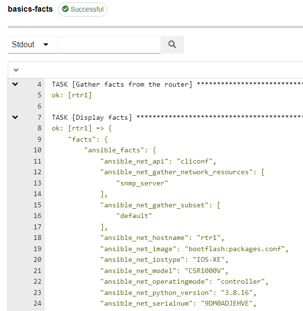
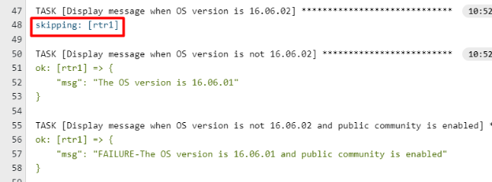

# Basics 1.7 - Facts And Conditionals

## Facts
**Facts**, as described when we were writing our first playbook, are a *set of variablized information returned about an automation host*.  By default Ansible will attempt to **gather facts**, but this will almost always break playbooks executed against network hosts.  This is why we default to putting "**gather\_facts: false**" at the beginning of our playbooks.  If, however, we did want to gather information from networking hosts, we are in luck, because there are network fact modules designed specifically for this purpose!

Let's write a playbook to demonstrate.  Start by creating a new playbook named **facts.yml** that consists of the following:

    ---
    - name: Gather facts from our switch and perform some conditional tests
      hosts: rtr1
      gather_facts: false
      tasks:
    
        - name: Gather facts from the switch
          cisco.ios.ios_facts:
            gather_subset: min
            gather_network_resources: snmp_server
          register: facts
    
        - name: Display facts
          ansible.builtin.debug:
            var: facts

As you can see here we've used the **ios\_facts** module.  If this were nxos switches we would use **nxos\_facts**.  For Juniper it would be **junos\_facts**… you get the idea.  For each OS type there is a different facts module you can use.

Notice how we have **gather\_subset** and **gather\_network\_resources** specified.  

**gather\_subset** refers to most of the legacy and hardware information (things like "`show version`" and "`show interfaces`").  

**gather\_network\_resources** refers to things you would typically pull out of the config: VLANs, ALCs, BGP, etc.

Here I'm gathering just the standard "`show ver`" and the **snmp\_server** configuration.

**Commit** and **Push** your new playbook.  Now in Ascender, **Sync** your project, **Clone** an existing template (name it **basics-facts**), and **Launch** the new playbook:

You should notice in your output a lot of handy variablized information, including the SNMP server changes we made in earlier playbooks.

## Conditionals
**Conditionals** are used in virtually every playbook I write.  It gives an admin the ability to run a task for an individual host based on whether a statement returns true or not.

**Conditionals** are very often *comparing* either one variable to another or one variable to a static value.  It's then "**when:**" option followed by a comparison:

Compare variables

    when: var1 == var2

Compare variable to static

    when: var1 >= 5

> I hope you noticed in the above that the variables didn't require quotes or curly braces.  This is one of the exception locations where they aren't required.

## Simple Conditional Playbook

Let's modify the **facts.yml** playbook we just created to add some test conditionals.  Add the following just under **gather\_facts: false** at the beginning:

      gather_facts: false
      vars:
        required_version: 16.06.01

I know we already covered **variables**, but I wanted to show adding a variable at the play level so that it will be utilized by all following tasks.  You simple add the **vars** parameter and then create as many variables as you like.  Here I'm created one named "**required\_version**" that I'll be using to verify my conditionals against.  Let's add some more:

        - name: "Display message when OS version is {{ required_version }}"
          when: facts.ansible_facts.ansible_net_version == required_version
          ansible.builtin.debug:
            msg: "The OS version is secure"

Here you can see our first conditional.  I'm checking the version of firmware on the device (**facts.ansible\_facts.ansible\_net\_version**) against my **required\_version** variable.  Again, notice that we didn't use quotes or curly braces on the conditional.  Add the below:

        - name: "Display message when OS version is not {{ required_version }}"
          when: facts.ansible_facts.ansible_net_version != required_version
          ansible.builtin.debug:
            msg: "The OS version is {{ facts.ansible_facts.ansible_net_version }}"

This task is very similar to the previous, but I changed the conditional from "**equal to**" over to "**not equal to**".  Also notice that in the **name field** I use the **required\_version** variable so that it will accurately display in the job output.  Let's add one final task:

        - name: "Display message when OS version is not {{ required_version }} and public community is enabled"
          when: facts.ansible_facts.ansible_net_version != required_version and facts.ansible_facts.ansible_network_resources.snmp_server.communities[1].name | default("tacos") == "public"
          ansible.builtin.debug:
            msg: "FAILURE-The OS version is {{ facts.ansible_facts.ansible_net_version }} and public community is enabled"

This last task has quite a long conditional in it.  Here you can see I used the "**and**" operator to make it a *compound* conditional.  So not only is it checking that the **required_version** doesn't match, but it will only display the message if the SNMP server is also using MD5 authentication.  

Compound conditionals can use "**and**" as well as "**or**".  They can also use *mathematical operators* like **()** in conjunction with "**and**" and "**or**" to make some pretty complex conditionals.

The completed playbook should look like this:

    ---
    - name: Gather facts from our router and perform some conditional tests
      hosts: rtr1
      gather_facts: false
      vars:
    #     required_version: 16.06.01
          required_version: 16.06.02
      tasks:
    
        - name: Gather facts from the router
          cisco.ios.ios_facts:
            gather_subset: min
            gather_network_resources: snmp_server
          register: facts
    
        - name: Display facts
          ansible.builtin.debug:
            var: facts
    
        - name: "Display message when OS version is {{ required_version }}"
          when: facts.ansible_facts.ansible_net_version == required_version
          ansible.builtin.debug:
            msg: "The OS version is secure"
    
        - name: "Display message when OS version is not {{ required_version }}"
          when: facts.ansible_facts.ansible_net_version != required_version
          ansible.builtin.debug:
            msg: "The OS version is {{ facts.ansible_facts.ansible_net_version }}"
    
        - name: "Display message when OS version is not {{ required_version }} and public community is enabled"
          when: facts.ansible_facts.ansible_net_version != required_version and facts.ansible_facts.ansible_network_resources.snmp_server.communities[1].name | default("tacos") == "public"
          ansible.builtin.debug:
            msg: "FAILURE-The OS version is {{ facts.ansible_facts.ansible_net_version }} and public community is enabled"

This is simulating generating a report if there is a vulnerability in a certain version of code with a "public" SNMP community.  Let's **Launch** it to see the result.

> **Be sure to comment, commit, push, and launch it!**

Notice how the first conditional task shows "**skipping**" in **blue**?  This means everything processed successfully, the host just didn't meet the conditional criteria, so it was **skipped**.  

[Back to Index](/docs/)