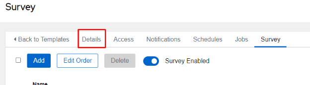

# Advanced 2.1 - Surveys

We are going to be quickly revisiting the *variables* lesson to examine surveys.  **Surveys** are a simple way to prompt a user for all kinds of various information to be used in a job template.  The information is simply injected into the playbook as **extra variables** (with **extra\_vars** having the highest level of precedence they will overwrite any existing variables with the same name).

## Playbook

We are simply going to reuse (you don't need to create anything in VSCode) the **facts.yml** playbook from **section 1.7**.  Just as a reminder, it's listed below.  The **blue** sections show that we are setting the **required\_version** variable in the playbook, and we won't be changing this in the playbook itself.  Rather we will be using a **survey** to overwrite these variables (since a survey passes values in as **extra\_vars**, they will have the highest precedence).  Keep in mind that the **green** line is where we actually utilize those variables.

    ---
    - name: Gather facts from our router and perform some conditional tests
      hosts: rtr1
      gather_facts: false
      vars:
        required_version: 16.06.02
      tasks:
    
        - name: Gather facts from the router
          cisco.ios.ios_facts:
            gather_subset: min
            gather_network_resources: snmp_server
          register: facts
    
        - name: Display facts
          ansible.builtin.debug:
            var: facts
    
        - name: "Display message when OS version is {{ required_version }}"
          when: facts.ansible_facts.ansible_net_version == required_version
          ansible.builtin.debug:
            msg: "The OS version is secure"
    
        - name: "Display message when OS version is not {{ required_version }}"
          when: facts.ansible_facts.ansible_net_version != required_version
          ansible.builtin.debug:
            msg: "The OS version is {{ facts.ansible_facts.ansible_net_version }}"
    
        - name: "Display message when OS version is not {{ required_version }} and public community is enabled"
          when: facts.ansible_facts.ansible_net_version != required_version and facts.ansible_facts.ansible_network_resources.nmp_server.communities[1].name | default("tacos")== "public"
          ansible.builtin.debug:
            msg: "FAILURE-The OS version is {{ facts.ansible_facts.ansible_net_version }} and public community is enabled"

## Cloning / Modifying Existing Template

I'll start by **cloning** the **basics-facts** job template.  You've done this several times now, so I won't spell it out explicitly.

Once the job template has been cloned, I'll **Edit** the **name** to **basics-facts-survey**:

Rename the template and **Save**:

Time to start creating my survey, so I'll click on the **Survey** tab and click **Add**, then I'm presented with the **Add Question** page:

I'll describe the sections seen above:

- **Question** - Required
  - Enter a prompt for the user to enter their information, try and be descriptive.
- **Description**
  - This is supplemental information to better describe what information should be collected or how it will be used.
- **Answer Variable Name** - Required
  - When the user inputs info and submits it, this is the variable name that will be passed to the playbook as an extra\_var.  Each survey question will have a unique variable name.
- **Answer Type** - Required
  - Text
    - Single line of text
  - Textarea
    - Allows for multiple lines of text
  - Password
    - Single line of text, but it is obscured with asterisks (IE \*\*\*\*\*\*)
  - Multiple Choice (single select)
    - Multiple options, but only one can be selected
  - Multiple Choice (multiple select)
    - Multiple options, but multiple selections are allowed
  - Integer
    - A number(how large is configurable) with no decimal place
  - Float
    - A number(how large is configurable) with decimal places allowed
- **Required** check box
  - Whether or not this question is required or if the user can leave it blank.
- **Minimum/Maximum length**
  - This defines how large an answer is allowed to be
- **Default answer**
  - This allows for a default answer or selection to be defined
  - It's often a good idea to give users an idea of what the most common selection is or a template for the type of answer you are looking for

At this point I'll add my first entry.  I'm going to ask for a **required_version**.  Keeping this in mind, I'll use the info from the below to fill in the blanks and click **Save**.  Remember, only the answer variable name must be exactly as below:

|Question|Required Version|
| :- | :- |
|Description|What IOS version is the approved current version?|
|Answer variable name|required\_version|
|Answer type|text|
|Required (checkbox)|Checked|
|Default answer|16\.06.02|

While my **survey** is complete, it's not currently being utilized.  I have to click the **Survey Disabled** radio button to **enable** it:

Now click **Details**, and **Launch** at the bottom of the template:

You should be presented with the following **Launch** form:

I'll set my **version** and click **Next**.  This will move me to a **Preview** screen:

It will move to the **Preview** section and show me the variables I've included in my survey:

Clicking **Launch** will run the job template with the supplied **extra\_vars**:

At any point you can go to **Jobs** under **Views**, select the **job**, click on **Details**, and view the supplied variables:

  

[Back to Index](/docs/)