Advanced 2.2 - Workflows

Thus far everything we’ve launched, automation wise, has been a single job template at a time.  This very well may be the way you execute much of your automation, but it’s often advantageous to tie multiple job templates together to run sequentially, and this is where workflows come in.  They allow you to visually chain together job templates you, your team, or other silos have created and which you have execute permissions on.  This means your playbooks can become smaller and more discrete automations.  This allows you to start snapping them together like toy blocks.  They become flexible pieces you can reuse with minimal effort or modification.

# Creating A Workflow
I’ll start by going into the Resource menu and clicking Templates. Then click Add and choose Add workflow template:

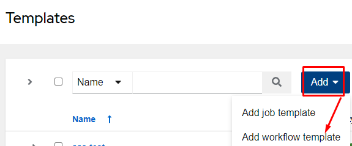

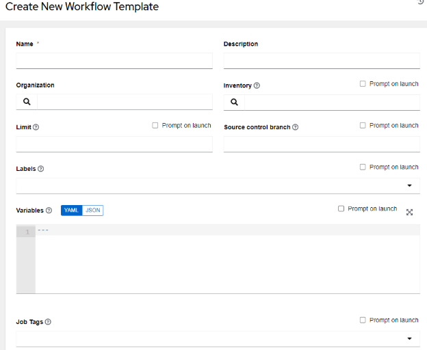

You are now in the workflow template screen, which should feel fairly familiar at this point; it looks almost identical to the job template screen.

Fill out the screen as follows and click Save:

|Name|advanced-workflow|
| :- | :- |
|Description|Workflow to configure SNMP server and perform ping tests.|
|Inventory|basics-inventory|

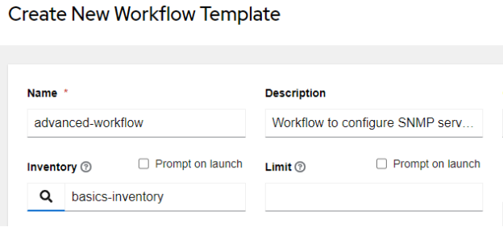

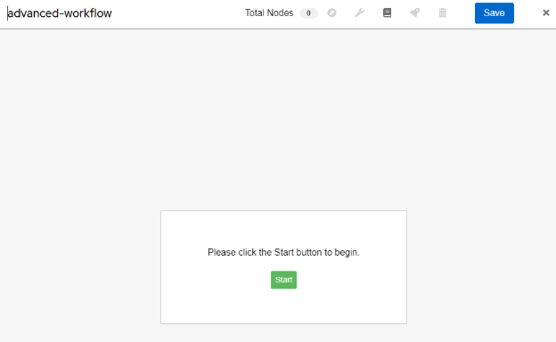

We now find ourselves in the Visualizer.  It’s from here we can visually build the workflow.  I’ll begin by clicking Start, which will bring us to the Add Node screen:

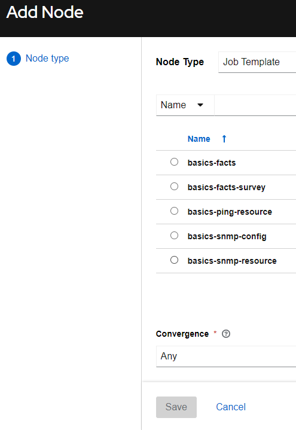

From here I’ll choose basics-snmp-resource and click Save:

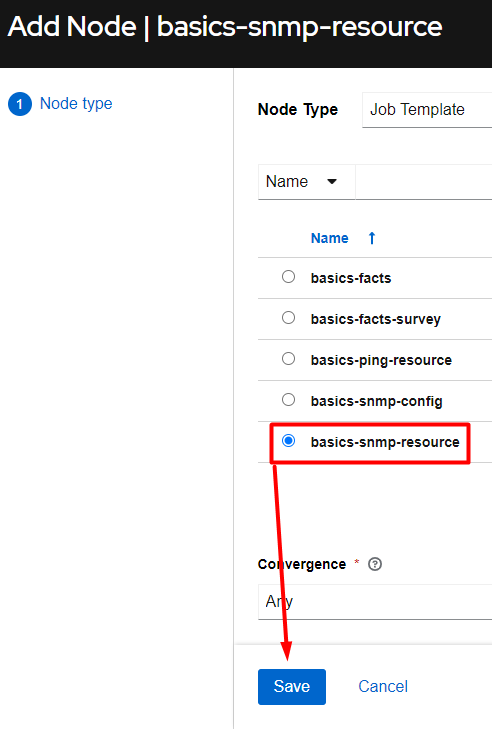

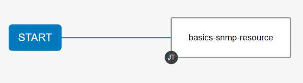

I’ll now click the plus sign “+” to the right of the basics-snmp-resource  job template, which will add an additional node in the workflow:

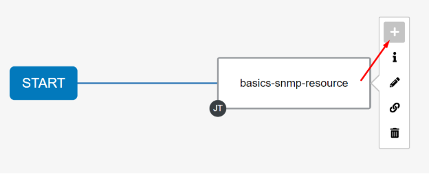

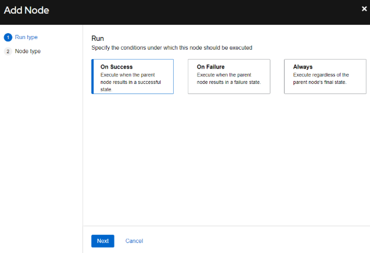

I’ll now choose On Success and then add the pings job template:

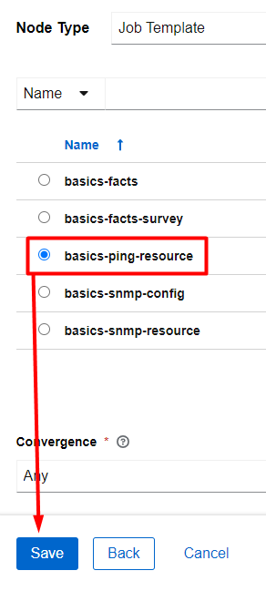

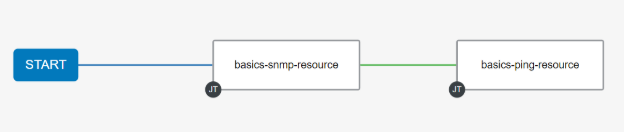

At this point I can now Save my workflow:

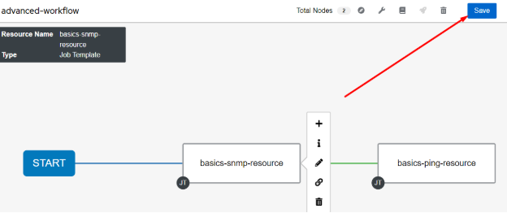

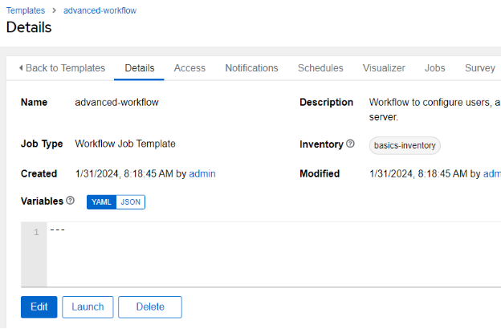

# Launching A Workflow
Launching the workflow is done the same way anything else is launched, either via the rocketship on the job templates menu or via the Launch button within the workflow itself.

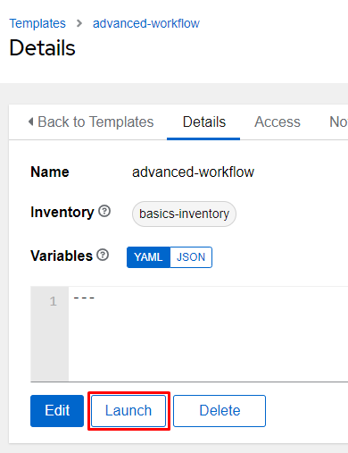

After the launch you are taken to the Job menu on that workflow itself.  You can watch the run progress via the small icons in each workflow node:

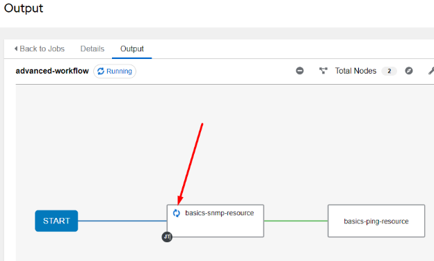

You can click on the node square and it will take you directly into that job in the job menu:

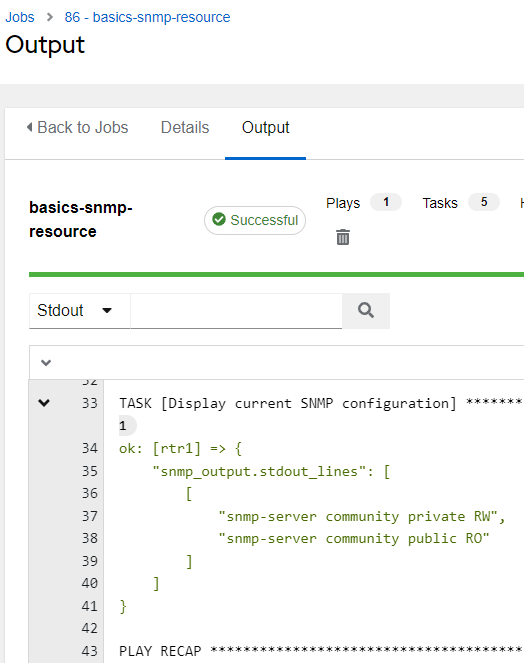

Once the job is complete you should see the green checkboxes on each workflow node:

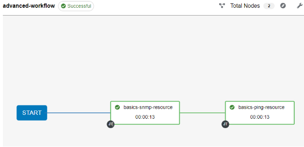
